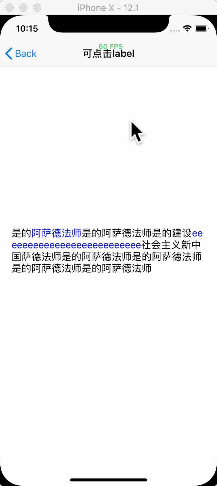

# SYTouchLabel




可使用 `CocoaPods` 集成使用。

```
pod 'SYTouchLabel'
```

使用如下：
```
    SYTouchLabel *label = [[SYTouchLabel alloc] init];
    label.lineBreakMode = NSLineBreakByCharWrapping;
    label.numberOfLines = 0;
    label.text = @"是的阿萨德法师是的阿萨德法师是的建设eeeeeeeeeeeeeeeeeeeeeeeeee社会主义新中国萨德法师是的阿萨德法师是的阿萨德法师是的阿萨德法师是的阿萨德法师";
    label.sy_clickString = @"eeeeeeeeeeeeeeeeeeeeeeeeee";
    label.sy_clickRange = NSMakeRange(2, 5 );
    [self.view addSubview:label];
    [label mas_makeConstraints:^(MASConstraintMaker *make) {
        make.center.equalTo(self.view);
        make.width.equalTo(self.view).offset(- 40);
    }];
    
    label.clickBlock = ^(NSString *clickString)
    {
        NSLog(@"点击的文本为 %@",clickString);
    };
```